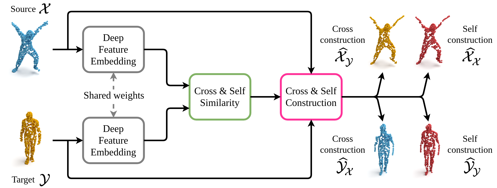
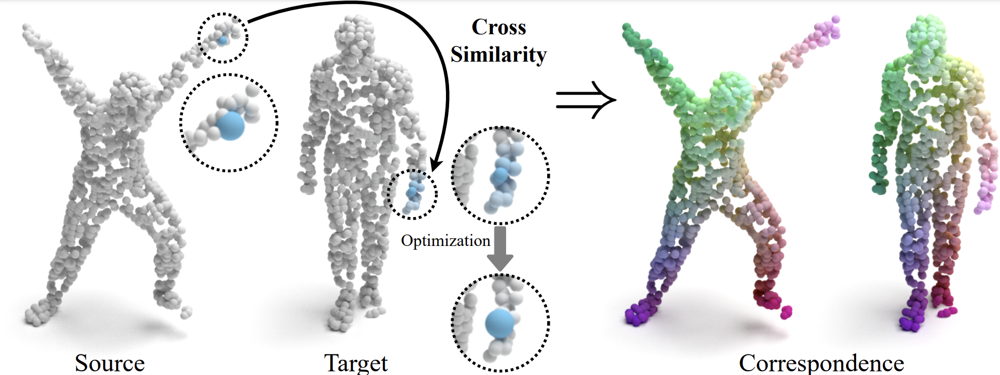
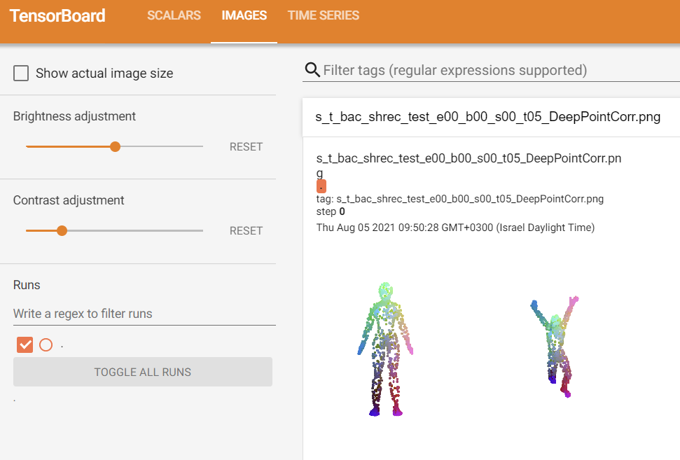

# DPC: Unsupervised Deep Point Correspondence via Cross and Self Construction (3DV 2021)

This repo is the implementation of [**DPC**](https://arxiv.org/abs/2110.08636). 

[](https://paperswithcode.com/sota/3d-dense-shape-correspondence-on-shrec-19?p=dpc-unsupervised-deep-point-correspondence)


&nbsp;


&nbsp;



## Tested environment
- Python 3.6
- PyTorch 1.6
- CUDA 10.2

Lower CUDA and PyTorch versions should work as well.

&nbsp;
## Contents
- [Installation](#installation)
- [Datasets](#datasets)
- [Train](#training)
- [Inference](#inference)
- [Cite](#citing-&-authors)

&nbsp;
# Installation
Please follow `installation.sh` or simply run
```
bash installation.sh 
```
&nbsp;

# Datasets
The method was evaluated on:
* SURREAL
  * 230k shapes (DPC uses the first 2k).
  * [Dataset website](https://www.di.ens.fr/willow/research/surreal/data/)
  * This code downloads and preprocesses SURREAL automatically.

* SHREC’19
  * 44 Human scans.
  * [Dataset website](http://3dor2019.ge.imati.cnr.it/shrec-2019/)
  * This code downloads and preprocesses SURREAL automatically.

* SMAL
  * 10000 animal models (2000 models per animal, 5 animals).
  * [Dataset website](https://smal.is.tue.mpg.de/)
  * Due to licencing concerns, you should register to [SMAL](https://smal.is.tue.mpg.de/) and download the dataset.
  * You should follow data/generate_smal.md after downloading the dataset.

* TOSCA
  * 41 Animal figures.
  * [Dataset website](http://tosca.cs.technion.ac.il/book/resources_data.html)
  * This code downloads and preprocesses TOSCA automatically.

&nbsp;
# Training

For training run
``` 
python train_point_corr.py --dataset_name <surreal/tosca/shrec/smal>
```
The code is based on [PyTorch-Lightning](https://pytorch-lightning.readthedocs.io/en/latest/), all PL [hyperparameters](https://pytorch-lightning.readthedocs.io/en/latest/common/trainer.html) are supported. 
(`limit_train/val/test_batches, check_val_every_n_epoch` etc.)

&nbsp;
## Tensorboard support
All metrics are being logged automatically and stored in
```
output/shape_corr/DeepPointCorr/arch_DeepPointCorr/dataset_name_<name>/run_<num>
```
Run `tesnroboard --logdir=<path>` to see the the logs.

Example of tensorboard output:



&nbsp;

# Inference
For testing, simply add `--do_train false` flag, followed by `--resume_from_checkpoint` with the relevant checkpoint.

```
python train_point_corr.py --do_train false  --resume_from_checkpoint <path>
```
Test phase visualizes each sample, for faster inference pass `--show_vis false`.

We provide a trained checkpoint repreducing the results provided in the paper, to test and visualize the model run
``` 
python train_point_corr.py --show_vis --do_train false --resume_from_checkpoint data/ckpts/surreal_ckpt.ckpt
```


&nbsp;
# Citing & Authors
If you find this repository helpful feel free to cite our publication -

```
@misc{lang2021dpc,
      title={DPC: Unsupervised Deep Point Correspondence via Cross and Self Construction}, 
      author={Itai Lang and Dvir Ginzburg and Shai Avidan and Dan Raviv},
      year={2021},
      eprint={2110.08636},
      archivePrefix={arXiv},
      primaryClass={cs.CV}
}
```

Contact: [Dvir Ginzburg](mailto:dvirginz@gmail.com), [Itai Lang](mailto:itai.lang83@gmail.com )
